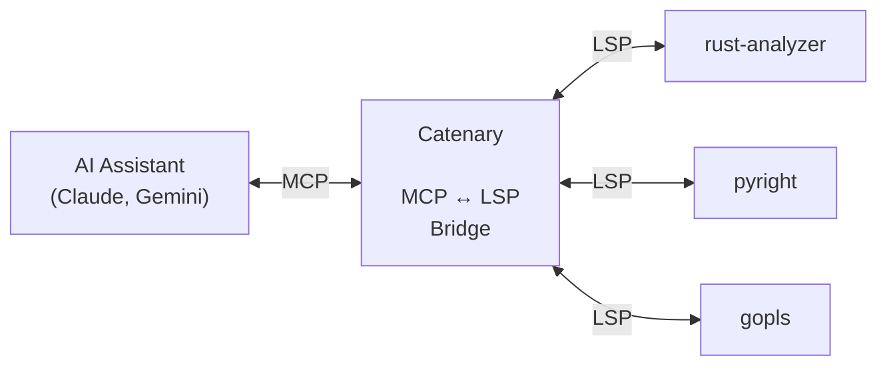

# Catenary

[](https://github.com/MarkWells-Dev/Catenary/actions/workflows/ci.yml)
[](https://github.com/MarkWells-Dev/Catenary/actions/workflows/cd.yml)

**Stop wasting context on redundant file reads.**

AI coding agents are smart. The bottleneck isn't intelligence — it's I/O.
Every file an agent reads goes into an append-only context window. Every edit
creates another copy. Three rounds of read-edit-verify on a single file puts
three full copies in context, re-processed on every subsequent turn. In a
typical session, this produces a **1,000x+ amplification** between what you
type and what the model actually processes.

Catenary replaces brute-force file scanning with **graph navigation**. Instead
of reading a 500-line file to find a type signature, the agent asks the
language server directly — 50 tokens instead of 2,000. Instead of grepping
across 20 files to find a definition, one LSP query returns the exact
location. The context stays lean across the entire session.

## How It Works



Catenary bridges [MCP](https://modelcontextprotocol.io/) and
[LSP](https://microsoft.github.io/language-server-protocol/), giving agents
the same code intelligence that powers your IDE. It manages multiple language
servers, routes requests by file type, and provides automatic post-edit
diagnostics — all through a single MCP server.

## Quick Start

### 1. Install

```bash
cargo install --git https://github.com/MarkWells-Dev/Catenary catenary-mcp
```

### 2. Configure language servers

Add your language servers to `~/.config/catenary/config.toml`:

```toml
[language.rust]
command = "rust-analyzer"

[language.python]
command = "pyright-langserver"
args = ["--stdio"]
```

### 3. Connect your AI assistant

> Plugins and extensions register hooks and MCP server declarations but
> **do not include the binary** — step 1 above is required.

**Claude Code**
```
/plugin marketplace add MarkWells-Dev/Catenary
/plugin install catenary@catenary
```

The plugin registers the MCP server and adds hooks for post-edit
diagnostics, editing state management, and workspace root sync.

**Gemini CLI**
```bash
gemini extensions install https://github.com/MarkWells-Dev/Catenary
```

The extension registers the MCP server and adds hooks for post-edit
diagnostics and editing state management.

### 4. Verify

Check that your language servers and hooks are working:

```bash
catenary doctor
```

```
rust         rust-analyzer       ✓ ready
             hover definition references document_symbols search code_actions call_hierarchy

python       pyright-langserver  ✓ ready
             hover definition references document_symbols search

toml         taplo               - skipped (no matching files)

Hooks:
  Claude Code 1.3.6 (directory) ✓ hooks match
  Gemini CLI  1.3.6 (linked)    ✓ hooks match
```

## Why This Matters

| Operation | Tokens | Copies in context |
|-----------|--------|-------------------|
| Read a 500-line file | ~2,000 | +1 per read |
| Rewrite that file | ~2,000 | +1 (now 2 copies) |
| Read it again to verify | ~2,000 | +1 (now 3 copies) |
| **Total for one file** | **~6,000** | **3 copies** |

| LSP alternative | Tokens | Copies in context |
|-----------------|--------|-------------------|
| `grep` for symbols + references | ~200 | 0 (stateless) |
| Native edit + hook diagnostics | ~300 | 0 (no re-read needed) |
| **Total** | **~500** | **0 copies** |

Every token in context is re-processed on every turn. Bigger context windows
don't fix this — they just let you waste more before hitting the wall.

## Tools

| Tool | Description |
|------|-------------|
| `grep` | Symbols, semantic references, and text matches |
| `glob` | Browse the workspace — file outlines, directory listings, glob matches |
| `start_editing` / `done_editing` | Batch editing — diagnostics deferred until you're done |
| hooks | Post-edit LSP diagnostics with quick-fix suggestions |

## Full Protocol Transparency

Catenary logs every protocol message — every MCP tool call, every LSP
request and response, every hook invocation — to a local SQLite database.
Run `catenary` to open the TUI dashboard and watch the message flow in
real time, or query historical sessions with `catenary query`.

You can see exactly what Catenary sends to your language servers and what
they send back. Nothing is hidden.

## CLI Commands

| Command | Description |
|---------|-------------|
| `catenary` | Launch the TUI dashboard |
| `catenary monitor <id>` | Stream events from a session |
| `catenary list` | List active and historical sessions |
| `catenary query` | Query session events (by session, time, kind, or raw SQL) |
| `catenary gc` | Garbage-collect old session data |
| `catenary doctor` | Verify language servers and hook installation |

## Known Limitations

**MCP tool display in CLIs.** Claude Code and Gemini CLI render built-in tools
with clean, purpose-built UI — diffs for edits, syntax highlighting for reads.
MCP tools get none of this. Catenary's tool calls show raw escaped JSON in
the approval prompt. This is a host CLI limitation, not something Catenary can
fix — MCP tools need the same display treatment as built-in tools.

File I/O uses the host's native tools (with full diff/highlight UX) and
Catenary provides diagnostics via the `PostToolUse` hook.

## Documentation

Full documentation at **[markwells-dev.github.io/catenary](https://markwells-dev.github.io/catenary/)**

- **[Installation](https://markwells-dev.github.io/catenary/installation.html)** — Setup for Claude Code, Gemini CLI, and other clients
- **[Configuration](https://markwells-dev.github.io/catenary/configuration.html)** — Language servers, settings, icons
- **[CLI & Dashboard](https://markwells-dev.github.io/catenary/cli.html)** — TUI dashboard and CLI commands

## License

**AGPL-3.0-or-later** — See [LICENSE](LICENSE) for details.

**Commercial licensing** available for proprietary use — see [LICENSE-COMMERCIAL](LICENSE-COMMERCIAL). Contact `contact@markwells.dev`.
